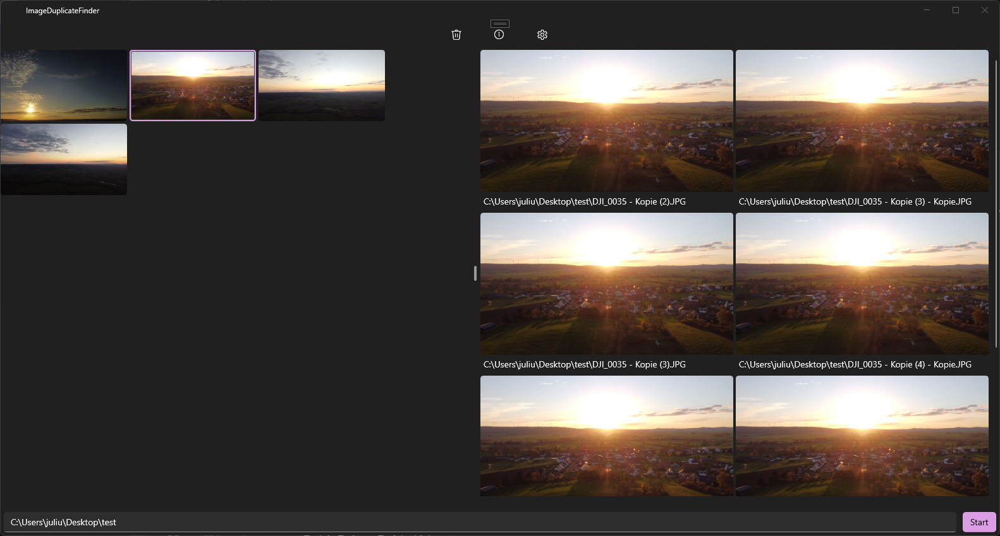

 

    
 

 <h1  align="center">ImageDuplicateFinder</h1>

    <!--
    -->
    
    
    

### What is ImageDuplicateFinder?
ImageDuplicateFinder is a simple way to find and remove duplicate images on Windows. It works by getting the SHA256 hash code for each image and storing those in a Dictionary. When the hashcode in the dictionary already exists, add the path to the dictionary item with the same hash code.

## Images

